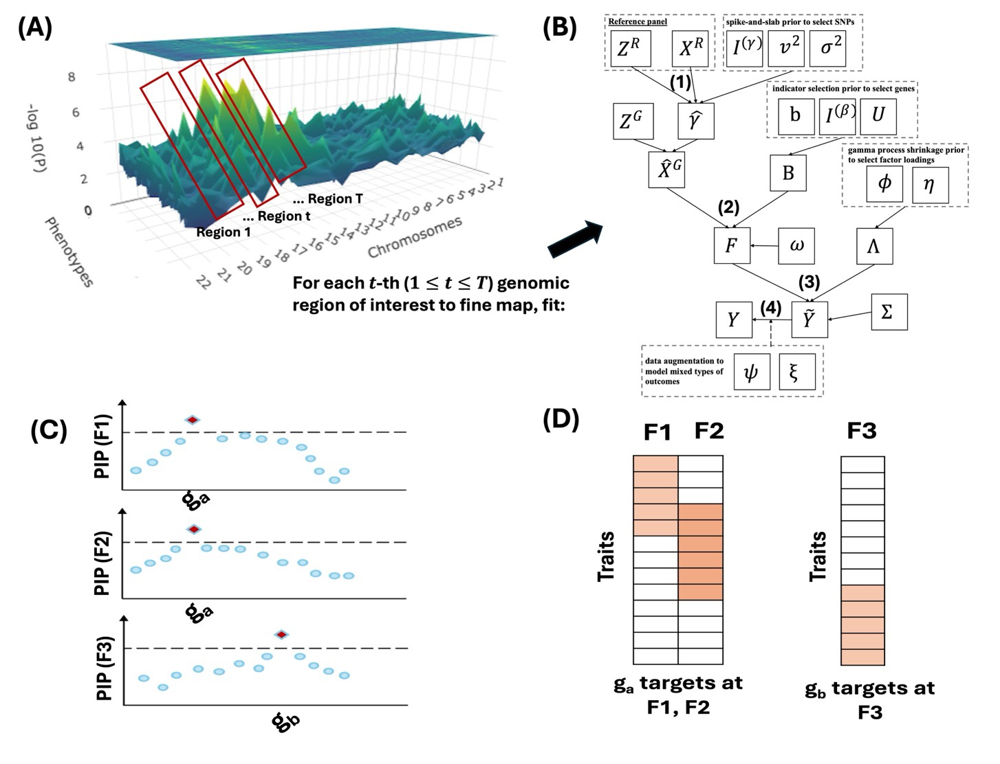

# FM-GPT

This is the repository for the **FM-GPT** (**F**ine-**m**apping of causal **G**enes for **P**henome-wide **T**ranscriptome-wide association studies). FM-GPT is a fine mapping method for Phenome-Wide-Transcriptome-Wide association studies providing efficient statistical analysis through dimension reduciton via latent factor representatino of high dimensional phenotype matrices. An important feature of FM-GPT is its ability to handle both continuous and discrete outcomes in a joint framework through a Polya-Gamma data augmentation scheme. FM-GPT is able to provide both the discovery of putatively causal genes, as well as detect their loading pattern on latent factors.



## Installation

FM-GPT can be installed by:

```
devtools::install_github("tacanida/fm-gpt")
```

## Usage
The primary function in the package is the `FMGPT` function. Specifically, it requires the user provides a matrix `X` of GReX data, a matrix `Y` of observed phenotypes, and a response vector indicating the data type of the outcome phenotypes. More detailed usage can be found in the [tutorial](example/FM_GPT_Tutorial.pdf) (note you may need to download the pdf to view, some browsers have issue displaying within GitHub).
